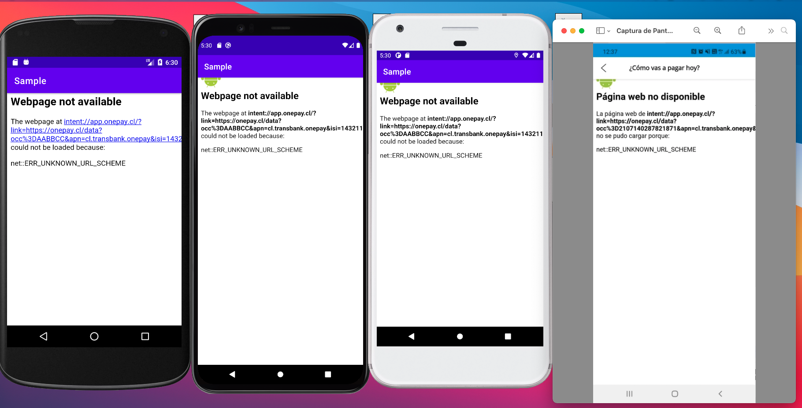

# transbank-sdk-webpay-android-client-example

## Contexto
Este ejemplo se crea para solucionar un error conocido que actualmente afecta en algunas páginas que utilizan
WebView dentro de una aplicación Android.

### ERR_UNKNOWN_URL_SCHEME
Este error pasa cuando intentamos utilizar un WebView y este no puede resolver el Intent correspondiente

Cuando declaramos un WebView necesitamos pasar un WebClient()

```kt
webView.webViewClient = WebViewClient()
```

El código anterior no soporta el uso de redirecciones hacia ninguna app, por lo que si utilizas
WebPay dentro de un WebView con esa referencia, obtendras un "ERR_UNKNOWN_URL_SCHEME"



### Solución propuesta
Para solucionar el problema de redirecciones dentro del WebView, se crea la clase llamada 
"WebViewTbkClient", esta clase permitirá a tu WebView redireccionar a otra aplicación en caso 
de utilizar un Dynamic Link y otro mecanismo similar.

```kt
class WebViewTbkClient : WebViewClient() {

    private val PREFIX = "intent://"
    private val EMPTY_STRING = ""
    private val FALLBACK_URL = "browser_fallback_url"
    private val TAG = "WebViewTbkClient"
    private val CONTEXT_ERROR_MESSAGE = "Se necesita el contexto para utilizar esta clase"
    private val FALLBACK_ERROR_MESSAGE = "Se necesita el parametro fallback_url en el Bundle del Intent"

    override fun shouldOverrideUrlLoading(view: WebView?, url: String?): Boolean {
        return if (isValidUrl(url)) {
            try {
                val context = getContextFromWebView(view)
                val intent = getIntentFromURL(url)
                view?.stopLoading()
                goToNewActivity(context, intent, view)
            } catch (e: Exception) {
                saveMessageLog(e.message ?: EMPTY_STRING)
            }
            true
        } else {
            false
        }
    }

    private fun getIntentFromURL(url: String?): Intent {
        return Intent.parseUri(url, Intent.URI_INTENT_SCHEME)
    }

    private fun getContextFromWebView(view: WebView?): Context {
        return view?.context ?: throw RuntimeException(CONTEXT_ERROR_MESSAGE)
    }

    private fun goToNewActivity(context: Context, intent: Intent, view: WebView?) {
        val info : ResolveInfo? = obtainInfoFromIntent(context, intent)

        if (info != null) {
            context.startActivity(intent)
        } else {
            val fallbackUrl = intent.getStringExtra(FALLBACK_URL) ?: throw RuntimeException(FALLBACK_ERROR_MESSAGE)
            view?.loadUrl(fallbackUrl)
        }
    }

    private fun obtainInfoFromIntent(context: Context, intent: Intent): ResolveInfo? {
        return context.packageManager.resolveActivity(intent, PackageManager.MATCH_DEFAULT_ONLY)
    }

    private fun saveMessageLog(message: String) {
        Log.e(TAG, message)
    }

    private fun isValidUrl(url: String?): Boolean {
        return url?.startsWith(PREFIX) ?: false
    }

}
```

### Ejemplo propuesto
En este ejemplo utilizaremos ViewBinding para evitar hacer el "findViewById" dentro de nuestro activity.
El código de ejemplo es este

```kt

class MainActivity : AppCompatActivity() {

    private lateinit var binding: ActivityMainBinding
    //Esta URL debe ser la de la página que quieras mostrar
    private val URL_TEST = "https://google.cl"

    override fun onCreate(savedInstanceState: Bundle?) {
        super.onCreate(savedInstanceState)
        binding = ActivityMainBinding.inflate(layoutInflater)
        setContentView(binding.root)
        setupWebView(binding.wvDynamicLink)
    }

    @SuppressLint("SetJavaScriptEnabled")
    private fun setupWebView(webView: WebView) {
        webView.webViewClient = WebViewTbkClient()
        webView.webChromeClient = WebChromeClient()
        webView.settings.javaScriptEnabled = true
        CookieManager.getInstance().setAcceptThirdPartyCookies(webView, true)
        webView.settings.cacheMode = WebSettings.LOAD_CACHE_ELSE_NETWORK
        webView.loadUrl(URL_TEST)
    }

    private fun destroyWebView(webView: WebView){
        CookieManager.getInstance().removeAllCookies(null)
        webView.clearCache(true)
        webView.webChromeClient = null
    }

    override fun onDestroy() {
        super.onDestroy()
        destroyWebView(binding.wvDynamicLink)
    }

}
```

### Sugerencias
Cualquier sugerencia de mejora será bien recibida, somos parte de una comunidad de desarrolladores
y sabemos que pueden salir mejores formas de lograr el mismo propósito.


